<div align="center">

</div>

<div align="center">


<br/>

<i>"I just think the guy with the most freedom in this whole ocean...<br/>is the Pirate King." — Monkey D. Luffy</i>

</div>

<br/>

```
$ whoami
ujwal@portfolio:~$ AI Engineer · GenAI & LLM Developer · Agentic AI Specialist

$ status --boot
[OK]   agent_network.init        — 5 agents online
[OK]   synthesizer.load          — conflict resolution ready
[OK]   memory.connect            — vector store mounted
[INFO] llm_scratch.build         — training loop active · epoch 3/∞
[OK]   portfolio.serve           — visitor detected
```


### 🏴‍☠️ I build first. Theorize later.

Working code teaches me things no paper ever could. I hack something together fast, get it running, then obsess over *why* it actually worked.

That's how **CodeSensei** was born — a rough multi-agent system in days, then weeks understanding why the synthesizer was failing, why agents contradicted each other, why parallel execution introduced race conditions I hadn't anticipated.

> AI is the biggest advancement in technology that has ever happened — and the rate of change is accelerating daily. The only way to not get swept away is to **understand it from within**. No shortcuts. No wrappers. No skipping the hard parts.

**Current obsession:** Building an LLM from scratch — every transformer block, every attention head, every gradient update. Not fine-tuning. Not APIs. I want to know what's happening inside the forward pass.


### ⚔️ Gear 5 — Current Stack

**GenAI & LLM**
<p>


</p>

**Vector & Memory**
<p>


</p>

**Languages & Frameworks**
<p>


</p>

**ML & Data**
<p>


</p>

**Tools & DevOps**
<p>


</p>

---

### 🗺️ Flagship Builds

#### 🧠 CodeSensei — AI Code Intelligence Platform
5 specialized agents — **structure · behavior · risk · execution · impact** — analyzing GitHub repos simultaneously, resolving conflicts via strict JSON contracts and synthesizer-based merge logic.

| Metric | Value |
|---|---|
| Codebase size | 5–10k LOC, 50–100 files |
| Full pipeline | 30–90 seconds |
| Semantic query | < 10 seconds |
| Agents | 5, one coherent output |

> The hardest part wasn't building the agents — it was making them not contradict each other.

`React` `TypeScript` `Node.js` `Gemini API` `D3.js` `Custom Orchestration`

[🔗 Repo](https://github.com/ujwal-sudo/CodeSensei) • [🚀 Live Demo](https://ujwalmahajan.vercel.app/)

#### 🌐 TalkToWeb — GenAI Browser Automation Agent
Natural language → multi-step browser actions. Navigation, form-filling, scraping — with voice control and a modular skills framework for extensible automations.

`LangChain` `Gemini 1.5 Flash` `Playwright` `Python` `FastAPI`

[🔗 Repo](https://github.com/ujwal-sudo/TalkToWeb)

---

### 🧬 How CodeSensei Thinks

<p align="center">

</p>


### ⚓ Leadership — Marathwada's First Robowars

Led a **300-team, 50-college, 2,000+ footfall** national robotics event at SGGSIE&T Nanded — ₹2L prize pool, 100% sponsored, zero institutional budget, 60 student volunteers.

> Leadership isn't doing everything — it's ensuring everything gets done.

---

### 📡 Connect

<p align="center">
<a href="https://linkedin.com/in/ujwal-mahajan-841710r"></a>
<a href="mailto:2023bec049@sggs.ac.in"></a>
<a href="https://ujwalmahajan.vercel.app/"></a>
</p>

<div align="center"><sub>→ establish_connection_</sub></div>

<div align="center">

</div>
